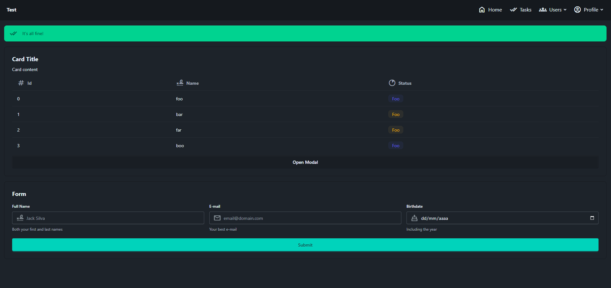

# 🌻 PaisyUI

A simple, extensible DaisyUI HTML renderer built on top of `bs4` — directly from Python.



## ✨ Why PaisyUI?

`paisy_ui` is a lightweight `42.6 kb` Python package powered by `BeautifulSoup` (`bs4`) that allows you to stop worrying about HTML templates and templating engines. By leveraging the beautiful [DaisyUI](https://daisyui.com) CSS framework, it makes UI building smoother and more intuitive.

PaisyUI offers:

- **100% pure Python** — no Node.js or frontend tooling required  
- **Fully extensible** — easily build custom components with custom behavior  
- **Compatible with any HTTP framework**, including:
  - [FastAPI](https://fastapi.tiangolo.com)  
  - [Flask](https://flask.palletsprojects.com/en/stable/)  
  - [Django](https://www.djangoproject.com/)  
- **CLI support** — generate HTML directly from your terminal (*⚙️ Work in Progress*)

---

## ⬇️ Installation

```bash
pip install paisy_ui
```

---

## ⚙️ Usage

### Basic Concepts

There are two component classes available:

- **BaseComponents** – raw HTML components without predefined classes or behaviors.
- **DaisyUI** – higher-level components styled with DaisyUI classes and/or made from multiple HTML elements.

Every component’s constructor accepts:

- **CSS classes** as positional arguments  
- **HTML attributes** as keyword arguments  

> Some DaisyUI components may also extract special attributes such as `title`, `menu_items`, and more.

All components inherit the `__call__` behavior from `BaseComponent`, which allows you to define children like this:

```python
from paisy_ui import BaseComponents

foo = BaseComponents.Div(style="padding:8px; background:red;")(
    BaseComponents.Div(style="padding:8px; background:green;")(
        BaseComponents.Div(style="padding:8px; background:blue;")(
            BaseComponents.Div(style="padding:8px; background:yellow;")(
                BaseComponents.Div(style="padding:8px; background:pink;")(
                    BaseComponents.P()("Hello World"),
                    BaseComponents.P()("This is another text"),
                    BaseComponents.Button(onclick="alert('ok')")("Ok"),
                )
            )
        )
    )
)

print(foo.prettify())
```

---

### 📦 BaseComponents Example

You can use `BaseComponents` to create custom HTML structures or extend them to define components with custom behavior:

```python
from paisy_ui import BaseComponents

class CustomComponent(BaseComponents.P):
    def _build(self):
        self.css("text-primary")

page = BaseComponents.HTML()(
    BaseComponents.Head()(
        BaseComponents.Link(
            href="./style.css",
            rel="stylesheet",
            type="text/css"
        )
    ),
    BaseComponents.Body()(
        BaseComponents.P()("Hello world"),
        CustomComponent()("Hello!")
    ),
)

print(page.prettify())
```

---

### 🌻 DaisyUI Example

`DaisyUI` components provide convenient abstractions for complex structures:

> *It also automatically imports [DaisyUI](https://daisyui.com/) and [Google Material Symbols](https://fonts.google.com/icons?icon.query=unk) using `CDN`.*

```python
from paisy_ui import DaisyUI

page = DaisyUI.HTML()(
    DaisyUI.LayoutNavbar(
        title="Test",
        menu_items=[
            DaisyUI.LayoutNavbar.MenuItem(label="Home", href="/home", symbol="home"),
            DaisyUI.LayoutNavbar.MenuItem(label="Users", href="/users", symbol="groups"),
            DaisyUI.LayoutNavbar.MenuItem(label="Tasks", href="/tasks", symbol="done_all"),
        ],
    )(
        DaisyUI.Modal(id="myModal")(
            DaisyUI.Title().primary()("Modal Title"),
            DaisyUI.Text()("Modal content")
        ),
        DaisyUI.Alert(symbol="done_all").success()("Everything ok!"),
        DaisyUI.Card()(
            DaisyUI.Title()("Card Title"),
            DaisyUI.Text()("Card Content"),
            DaisyUI.Badge().primary().soft()("Foo"),
            DaisyUI.Button(onclick="myModal.openModal()")("Open Modal"),
        )
    )
)

print(page.prettify())
```

---

## Examples

1. FastAPI:
```bash
poetry run fastapi run examples/with_fastapi.py --reload
```